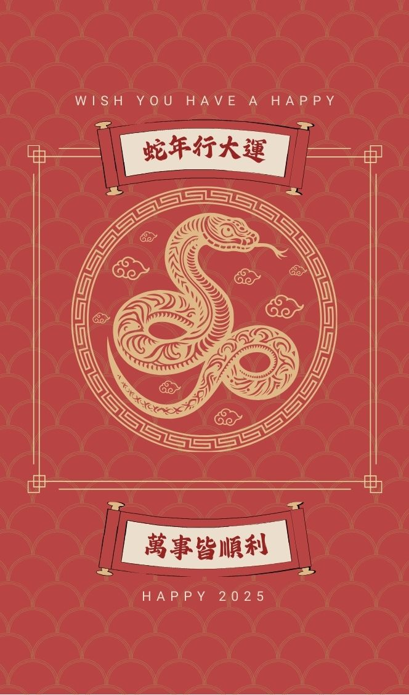

# HeKa - 互動翻轉卡片

一個展示可自訂化翻轉卡片的互動前端專案，具有順暢的動畫效果和響應式設計。此專案非常適合用於展示創意卡片設計，如名片、邀請函或活動宣傳。

## 功能 🎨

- **翻轉卡片動畫**：平滑的水平和垂直翻轉動畫，並即時響應用戶互動。
- **響應式設計**：自動調整卡片大小以適應直立和橫向螢幕，保持比例不變。
- **可自訂外觀**：輕鬆修改背景漸層、卡片圖片和動畫樣式。
- **動態互動**：支援拖曳翻轉手勢和移動設備上的雙指縮放互動。

## 演示 ✨

### 前端效果

- **卡片翻轉**：
  - 水平拖曳以翻轉卡片的正面和背面。
  - 翻轉至背面後，垂直拖曳可使卡片「上下顛倒」。
- **響應式設計**：
  - 卡片在所有螢幕尺寸上保持其長寬比例（664:1129），包括直立和橫向方向。

---

## 自訂化 🛠️

### 1. 修改背景顏色

要更改漸層背景，請在 HTML 檔案中找到以下 CSS 區段，並根據需要調整漸層顏色：

```css
body {
  background: linear-gradient(90deg, #fec5e5, #b3f4d8, #b3d4f4);
}
```

將 `#fec5e5`、`#b3f4d8` 和 `#b3d4f4` 替換為你喜歡的顏色。你也可以嘗試使用 `radial-gradient` 或調整漸層角度。

---

### 2. 更換卡片圖片

替換 `.front` 和 `.back` 容器內 `` 標籤的 `src` 屬性：

```html
<div class="card-side front">
  
</div>
<div class="card-side back">
  
</div>
```

將 `1.jpg` 和 `2.jpg` 替換為你的新圖片（例如 `front.jpg` 和 `back.jpg`），並將 `src` 路徑相應更新。

---

### 3. 調整翻轉動畫

要調整翻轉效果，請在 JavaScript 部分找到控制翻轉行為的程式碼：

```javascript
card.style.transform = `rotateY(${currentAngle}deg) scale(${currentScale})`;
```

你可以修改旋轉角度或縮放行為以符合你的需求。例如：

- 通過自訂 `.card` 的 `transition` 屬性來添加緩動效果：

  ```css
  .card {
    transition: transform 1s cubic-bezier(0.68, -0.55, 0.27, 1.55);
  }
  ```

---

## 如何使用 💻

### 1. 克隆儲存庫

```bash
git clone https://github.com/lazyjerry/heka.git
```

### 2. 本地開啟

導航至專案目錄並在瀏覽器中打開 `index.html` 檔案。

---

## 參與貢獻 🤝

歡迎你 Fork 此儲存庫、提出改進建議或提交 Pull Request。任何貢獻都是受歡迎的！

---

## 專案連結 🔗

[GitHub 儲存庫](https://github.com/lazyjerry/heka)
